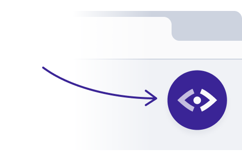

# Introduction to CodeSee

_**Note: CodeSee is early beta software**. Write us at <a href="mailto:support@codesee.io">support@codesee.io</a> with support questions, feedback, or feature requests._

---

CodeSee is a tool for developers and development teams. It enables you to visualize how your code works, document your understanding, and share this knowledge with others.

## How CodeSee works

  

Once you install CodeSee in your codebase, you'll be able to make recordings of the inner workings of your application.

When you run your app locally with CodeSee installed, you’ll see a button with the CodeSee logo. Click the CodeSee button to **start recording**, then interact with your app. When you want to **stop recording**, click the button again.

CodeSee will create a visual execution map called a **Data Flow** where you can explore all the code that ran in execution order, inspect runtime data, traverse looping operations, and see important side effects like network requests and responses.

You’ll also see a summarized view of the code in the **Overview** tab. You'll be able to capture your thoughts and connect commentary directly to the code in the Data Flow using a feature called **Stories**, available in the right-most panel.

CodeSee currently works with JavaScript and TypeScript web applications and can record data flows on both the front end and back end (experimental). By default, recordings from your app are hosted securely to be viewed from the web. See 'Advanced setup' for instructions on configuring your app to run locally.

## Next steps 
  
* [Install CodeSee into a project](/install/installation)
* [Set up CodeSee locally](/local/local/)

